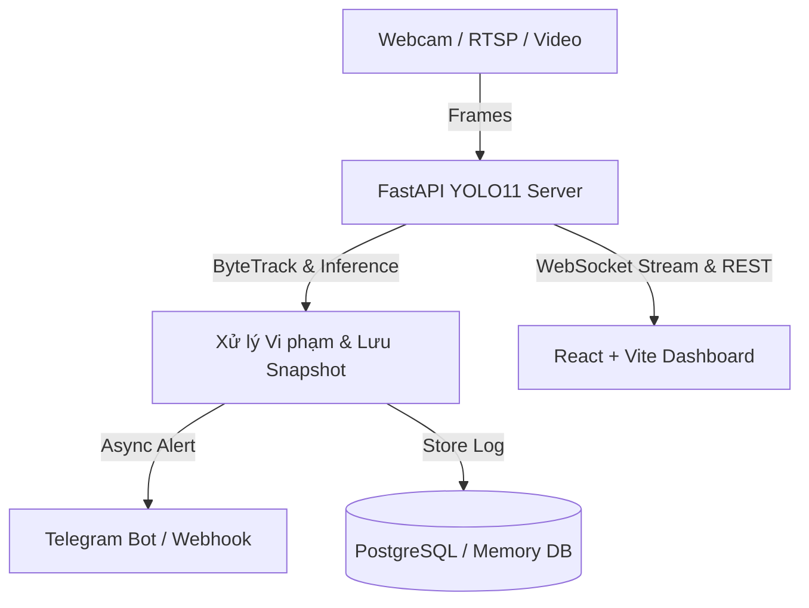

# 🛡️ AI Safety Monitor - Hệ Thống Giám Sát An Toàn Lao Động Thông Minh

Hệ thống thị giác máy tính thông minh (Computer Vision) giám sát và cảnh báo vi phạm an toàn lao động (PPE - Personal Protective Equipment) theo thời gian thực sử dụng **YOLO11**, **ByteTrack**, **FastAPI** và giao diện điều khiển **React/Vite**.

---

## 🌟 Tính Năng Nổi Bật

- 🔍 **Nhận diện chuẩn PPE 10 lớp**:
  - **An toàn**: `helmet` (Mũ), `vest` (Áo phản quang), `gloves` (Găng tay), `boots` (Ủng bảo hộ), `goggles` (Kính).
  - **Vi phạm**: `no-helmet`, `no-vest`, `no-gloves`, `no-boots`, `no-goggles`.
- 🎯 **Theo dõi đa đối tượng (ByteTrack)**: Khử nhiễu, chống trùng lặp cảnh báo vi phạm khi cùng một công nhân đứng trong khung hình.
- ⚡ **WebSocket Live Stream**: Truyền tải luồng video xử lý độ trễ cực thấp (< 50ms) từ Webcam USB/Laptop, RTSP IP Camera hoặc chế độ Giả lập (Mock Stream).
- 📸 **Tự động chụp Snapshot Vi phạm**: Lưu vết bằng chứng với nhãn, thời gian và độ tin cậy.
- 📲 **Cảnh báo Đa kênh Thời gian thực**: Tự động gửi tin nhắn + ảnh vi phạm qua Telegram Bot hoặc Webhook tới quản lý công trường.
- 📊 **Xuất Báo Cáo Chuyên Nghiệp**: Trích xuất dữ liệu vi phạm và biểu đồ thống kê ra file Excel (`.xlsx`) hoặc CSV đa kỳ (Hôm nay, Tuần, Tháng, Toàn bộ).
- ⚙️ **Bật/Tắt Quy Định Linh Hoạt**: Cấu hình kiểm tra trang bị tùy biến trực tiếp từ giao diện Web.

---

## 🏗️ Kiến Trúc Hệ Thống



---

## 🚀 Hướng Dẫn Cài Đặt & Khởi Chạy Trên Máy Mới

### Yêu Cầu Hệ Thống (Prerequisites)
- **Python**: 3.11 trở lên
- **Node.js**: 18 trở lên & `npm`
- *(Tùy chọn)* **Docker & Docker Compose** (nếu muốn chạy đóng gói container)
- *(Tùy chọn)* **NVIDIA GPU** hỗ trợ CUDA (nếu muốn tăng tốc độ FPS)

---

### 👉 Cách 1: Chạy trực tiếp (Khuyến nghị cho Development)

#### Bước 1: Clone Repository
```bash
git clone https://github.com/DuyTrum/AI-Safety-Monitor.git
cd AI-Safety-Monitor
```

#### Bước 2: Cấu hình Backend (Python)
1. Tạo và kích hoạt môi trường ảo:
   ```bash
   # Trên Windows (PowerShell):
   python -m venv .venv
   .\.venv\Scripts\Activate.ps1

   # Trên Linux / macOS:
   python3 -m venv .venv
   source .venv/bin/activate
   ```

2. Cài đặt các thư viện cần thiết:
   ```bash
   pip install --upgrade pip
   pip install -r requirements.txt
   ```

3. Khởi chạy Backend Server:
   ```bash
   python src/main.py
   ```
   > 💡 Backend sẽ chạy tại: **`http://localhost:8000`** (Tài liệu API Swagger: `http://localhost:8000/docs`).
   > *Hệ thống tự động sử dụng trọng số sẵn có tại `weights/best.pt` và tự fallback In-Memory nếu chưa cài PostgreSQL.*

#### Bước 3: Cấu hình Frontend (React + Vite)
Mở một cửa sổ Terminal mới:
```bash
cd frontend
npm install
npm run dev
```
> 🌐 Truy cập giao diện giám sát tại: **`http://localhost:5173`** (hoặc port do Vite thông báo).

---

### 👉 Cách 2: Chạy 1 Lệnh với Docker Compose

Nếu máy đã cài sẵn **Docker Desktop**:
```bash
docker-compose up -d --build
```
Hệ thống sẽ tự động khởi tạo 3 dịch vụ:
- **Frontend Dashboard**: `http://localhost:3000`
- **Backend FastAPI**: `http://localhost:8000`
- **Database PostgreSQL**: Port `5433`

Để dừng hệ thống:
```bash
docker-compose down
```

---

## 🛠️ Hướng Dẫn Sử Dụng Các Script CLI

### 1. Nhận diện trên Ảnh / Video / Webcam (Inference)
```bash
# Nhận diện trên thư mục ảnh mẫu:
python src/predict.py --source data/sample_images --save

# Nhận diện trực tiếp qua Webcam máy tính:
python src/predict.py --source 0 --show

# Nhận diện trên tệp Video:
python src/predict.py --source duong_dan_video.mp4 --save
```

### 2. Đánh giá Mô hình (Validation / Testing)
```bash
python src/validate.py --model weights/best.pt --data data/ppe_dataset/data.yaml --split test
```

### 3. Huấn luyện lại Mô hình (Re-training YOLO11)
```bash
python src/train.py --model yolo11s.pt --data data/ppe_dataset/data.yaml --epochs 100 --batch 16 --device 0
```

### 4. Xuất Mô hình (ONNX / TensorRT)
```bash
python src/export.py --model weights/best.pt --format onnx --imgsz 640
```

### 5. Bộ Video Kiểm Thử Công Trường (Test Video Suite) & Quy Trình Kiểm Thử
Hệ thống tích hợp sẵn bộ 5 video kiểm thử chuyên biệt chuẩn 720p 25fps cho từng kịch bản nghiệp vụ:
```bash
# Tự động sinh trọn bộ 5 video kiểm thử kịch bản:
python scripts/generate_test_videos.py

# Xem danh sách và kiểm tra thông số kỹ thuật các video có sẵn:
python scripts/download_sample_videos.py --list

# Tải thêm video thực tế từ YouTube hoặc nguồn mở:
python scripts/download_sample_videos.py --url <URL_VIDEO> --name custom_cctv.mp4
```
> 📄 Xem chi tiết **Quy trình kiểm thử 12 tính năng chuẩn ISO/IEC/IEEE 29119 & QCVN 18:2021/BXD** tại: [`QUY_TRINH_KIEM_THU_TOAN_BO_CHUC_NANG.md`](QUY_TRINH_KIEM_THU_TOAN_BO_CHUC_NANG.md).

---

## 📁 Cấu Trúc Thư Mục Dự Án

```
AI-Safety-Monitor/
├── configs/
│   └── settings.json          # Cấu hình thông báo Telegram, Webhook & Rules
├── data/
│   ├── sample_images/         # Ảnh mẫu chạy thử nghiệm ngay sau khi clone
│   ├── violations/            # Thư mục lưu ảnh Snapshot vi phạm
│   └── reports/               # Thư mục lưu báo cáo Excel/CSV trích xuất
├── frontend/                  # Ứng dụng Web React + Vite + CSS hiện đại
│   ├── src/
│   │   ├── App.jsx            # Giao diện dashboard thời gian thực
│   │   └── App.css            # Stylesheet giao diện Dark Mode cao cấp
│   ├── package.json
│   └── Dockerfile
├── src/                       # Mã nguồn Backend Python
│   ├── main.py                # FastAPI Server + WebSocket Streamer + DB Manager
│   ├── train.py               # Huấn luyện mô hình YOLO11
│   ├── validate.py            # Đánh giá độ chính xác mAP, Precision, Recall
│   ├── predict.py             # Chạy suy luận độc lập (CLI)
│   ├── export.py              # Xuất mô hình sang ONNX/Engine
│   └── utils/
│       ├── notifier.py        # Module gửi cảnh báo Telegram & Webhook
│       ├── reporter.py        # Module xuất báo cáo Excel & CSV
│       └── snapshot.py        # Module chụp và quản lý ảnh bằng chứng
├── weights/
│   └── best.pt                # Checkpoint trọng số mô hình YOLO11 đã huấn luyện
├── .env.example               # Mẫu biến môi trường
├── .gitignore                 # Cấu hình bỏ qua tệp rác và dataset nặng
├── docker-compose.yml         # Thiết lập chạy toàn bộ stack bằng Docker
├── Dockerfile                 # Đóng gói Backend container
├── requirements.txt           # Danh sách thư viện Python
└── README.md                  # Tài liệu hướng dẫn sử dụng
```

---

## 🔔 Cấu Hình Cảnh Báo Telegram & Webhook

1. Mở giao diện Dashboard tại `http://localhost:5173` (hoặc `http://localhost:3000`).
2. Nhấp vào nút **⚙️ Cài đặt Cảnh báo** ở góc trên bên phải.
3. Điền thông tin:
   - **Telegram Bot Token**: Lấy từ `@BotFather`.
   - **Telegram Chat ID**: ID của người nhận hoặc nhóm nhận thông báo.
   - **Webhook URL**: *(Tùy chọn)* Endpoint nhận JSON sự kiện.
4. Bấm **Lưu cấu hình**. Hệ thống sẽ tự động gửi thông báo kèm hình ảnh ngay khi phát hiện vi phạm mới!

---

## 📜 Giấy Phép & Tác Quyền

Dự án được phát triển phục vụ mục đích giám sát an toàn lao động thông minh và nghiên cứu ứng dụng AI trong doanh nghiệp.
Mọi đóng góp (Pull Requests) hoặc báo lỗi (Issues) đều được hoan nghênh!
